# Installing OpenShift on vMWare and Deploying a Sample Application - Part 3

By Paul Lucas

The release of Red Hat OpenShift 4.7 added a new vSphere Installer Provisioned Installation (IPI) option that makes it very easy to quickly provision an OpenShift cluster in a VMWare EXSi environment.  This cluster could be used for some quick testing or development.

The "straight" out of the box installation creates three control plane nodes and three worker nodes with minimal effort.  The EXSi IPI installation optional supports additional customizations, but in this example I will not use any of the customization capabilities.

For this tutorial I'm using a home built lab made up of three x86 8-core 64GB RAM machines formerly used for gaming purposes.  The EXSi environment is a bare bones VMWare vSphere Essentials 7.0.3 setup.  I'm using a two bay Synology NAS for shared storage across the vSphere cluster.  Finally I ran the installation from a RHEL 8 server instance that was hosting both DNS and DHCP services.  The command line instructions are run from a terminal of a RHEL 8 server VM running in this vSphere cluster.

## Deploying Our First Application

### Installing a simple test application
- We have been doing a lot of work from the command line, so let's switch to the OpenShift Administration Console to set up our new application.

- Paste the OpenShift Administration Console url into a web browser.  The admin console url for my cluster looks like this - https://console-openshift-console.apps.ocp4.example.com. 

- At the admin console, click the cluster-users button and on the next screen provide your username and password, and then click the blue Log in button.  For this part of the tutorial we are going to login as the developer. 

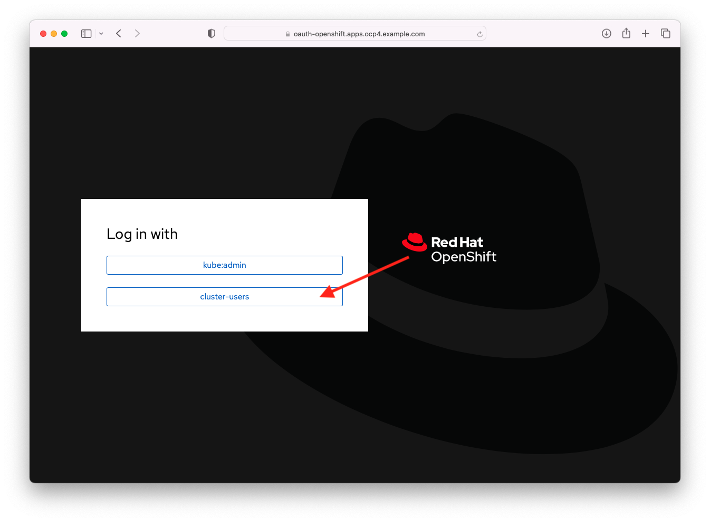

- On the admin console in the upper right corner you will see that you are logged in as the developer.  In the Administrator perspective on the Home screen you will see two projects including the my-first-app project we just created.  You have two perspectives in the admin console, Administrator and Developer, that change the perspective to provide you with the tabs appropriate to the type of work or activities you would do in each role.  Click on the drop down near the upper left of your screen and choose Developer to change to the developer's perspective.  As the Developer, you do not have full admin rights to the OpenShift cluster as we didn't grant those to you earlier in the tutorial.

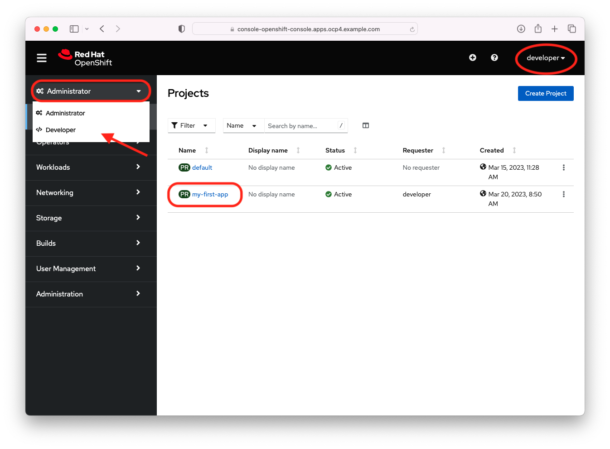

- In the Developer perspective make sure you are on the Topology tab and then click project drop down and choose the my-first-app project.

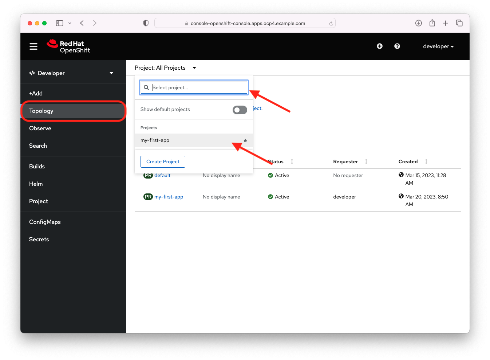

- Currently in the Topology view there are no application deployments. We can choose the +Add tab or click the Add age link to create a deployment from the sample applications.  Click the Add page link.

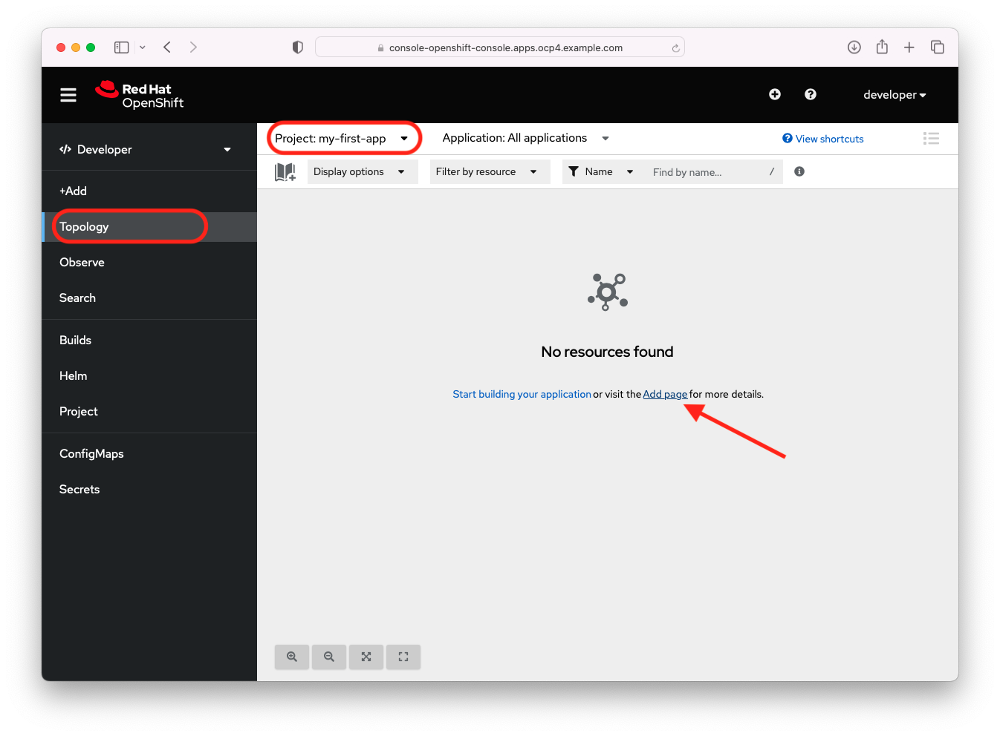

- On the add page click the View all sample link on the Create applications using samples tile.

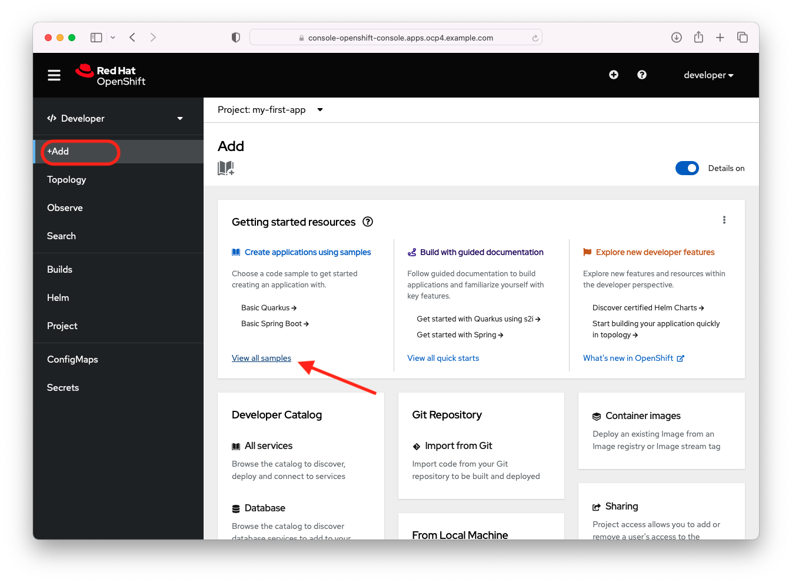

- On the Samples page, start typing 'Ngin' in the search field and click on the Nginx tile.

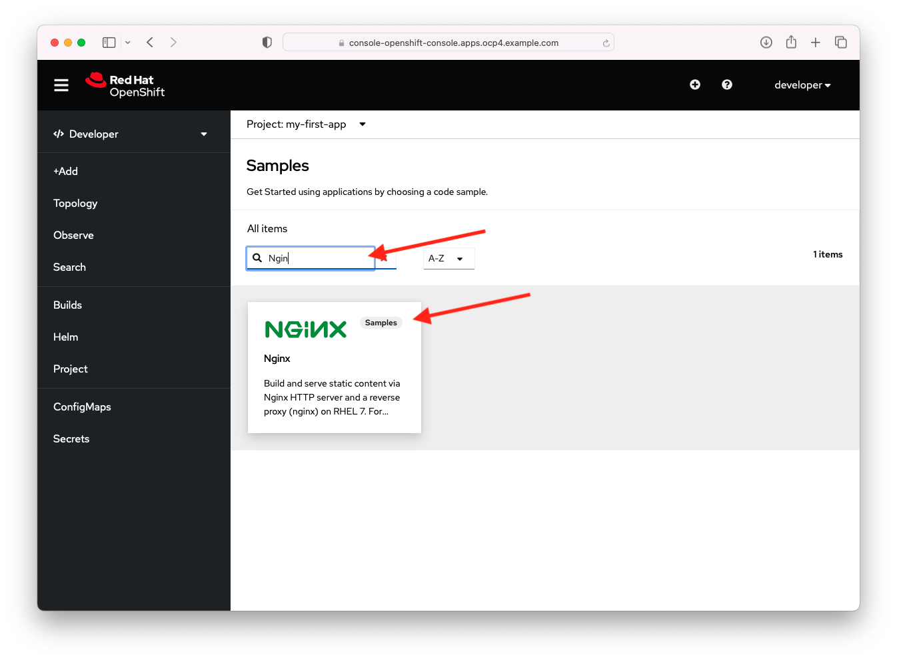

- For our sample Nginx application let's give it the name 'my-first-nginx' in the Name text field and choose the 1.20-ubi8 image version from the Builder Image version drop down list.  For our sample I chose the Nginx running in the Universal Base Image (UBI) 8.  Feel free to choose any UBI version.  Finally click the blue Create button to start our deployment.

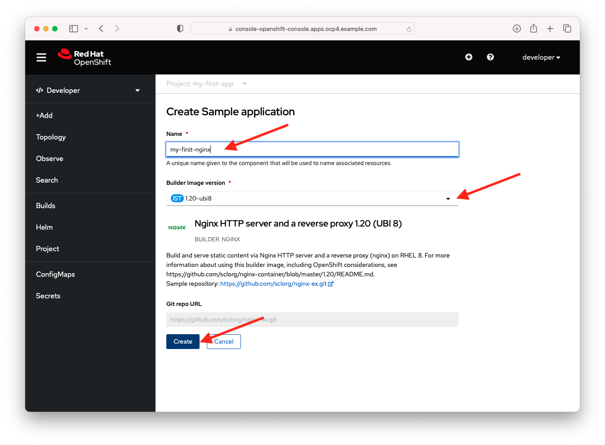

- When the build deployment starts, the first step is creating the build of the application.  The admin console will take you to the Topology view and you will see the deployment tile for our application.  Click on the tile to bring up the details of our deployment and you will see the Build is in process.

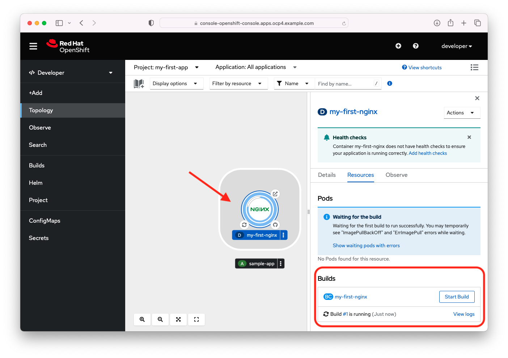

- When you see that the build is complete, scroll down and you will see that Services and a Route has been created for our deployment.  Click the Route link for my-first-nginx deployment to see the application.

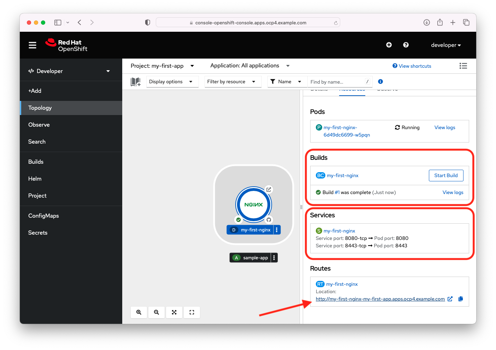

- Congratulations!  You've successfully installed a Red Hat OpenShift cluster, created users, created your first project and deployed your first application.

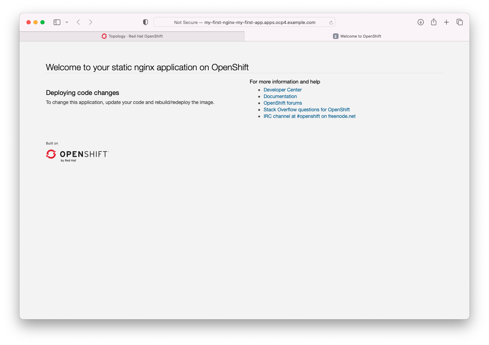

- Back at the Topology view, you can right click the three dots on the deployment button of the my-first-nginx deployment to bring up a context senstive menu.  From here you can easily view and/or edit additional deployment options.

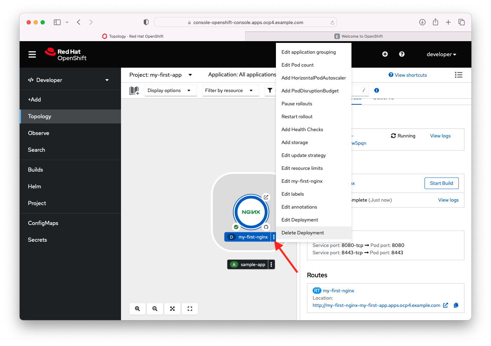

- Change your perspective back to the Administrator perspective and look through the other configuration settings we created earlier via the command line.  You can also perform the activies we did previously on the command line through Adminstrator perspective in the admin console.

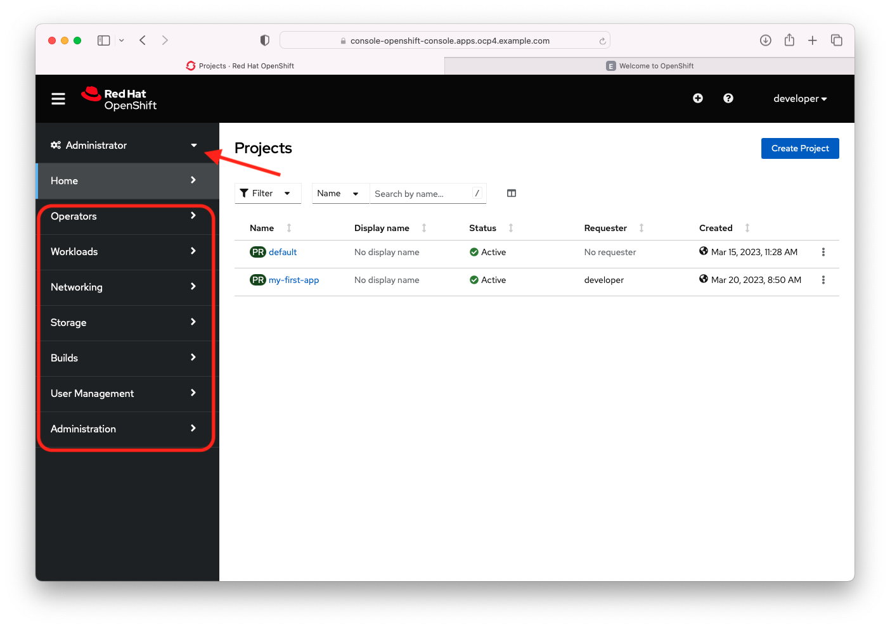

### Summary
In this tutorial we have seen how easily and quickly we can provision a standalone Red Hat OpenShift cluster to an EXSi environment via the Installer-provisioned Installation (IPI). We can use this standalone OpenShift cluster for some quick testing or development.  We've seen how we can easily use the 100% kubernetes compliant command line to create projects and users.  We have seen how easy it is to use the intuitive OpenShift Administrator Console to create, configure, manage and monitor kubernetes objects in our OpenShift cluster.

OpenShift provides you with an end-to-end enterprise ready kubernetes environment with all the tools.  Openshift supports you from development and testing kubernetes based applications on the desktop and to deploying these applications to a production OpenShift cluster.  Red Hat provides you with all the tools you need to automate your development and deployments.  If you have a favorite tool or product you would like to use with OpenShift for development, CI/CD pipelines, security, etc., you can add those tools to your 100% kubernetes compliant OpenShift cluster.

 ### Appendix
 - [OpenShift Container Platform 4.12 Documentation](https://docs.openshift.com/container-platform/4.12/welcome/index.html)
